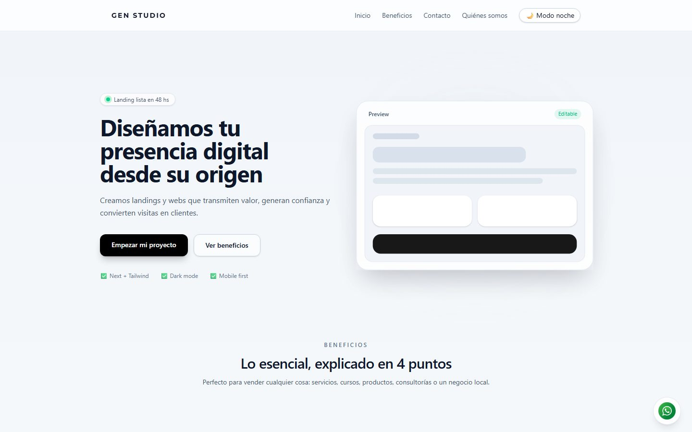
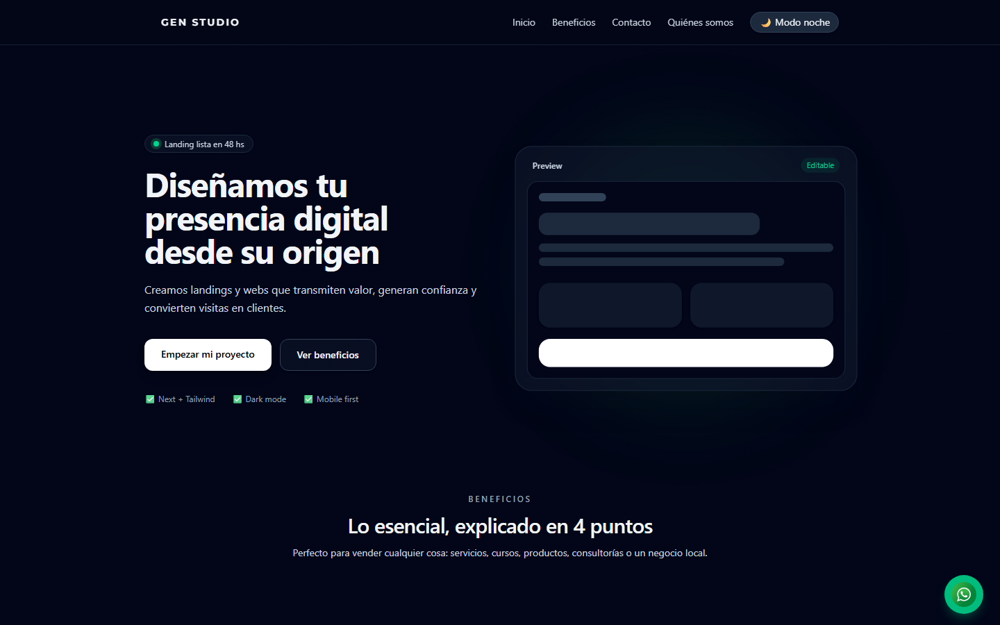
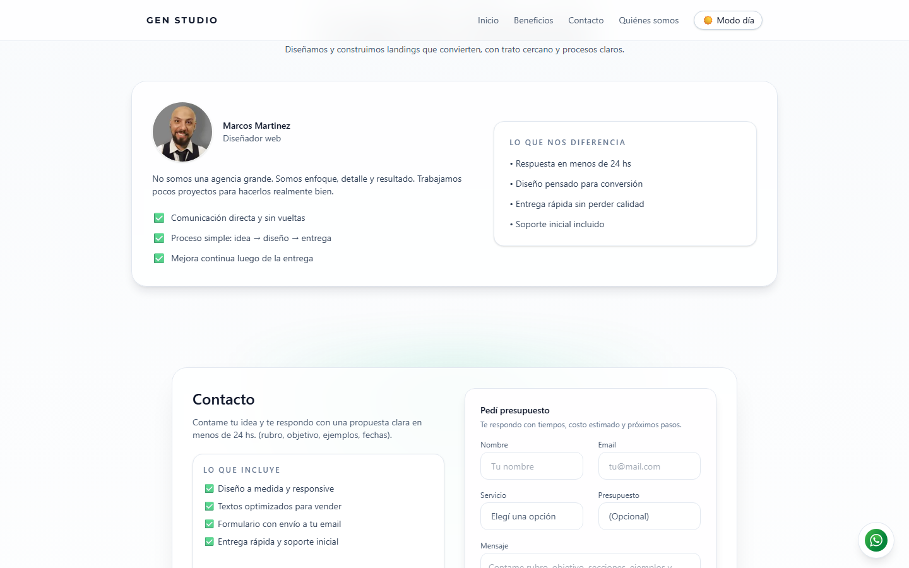
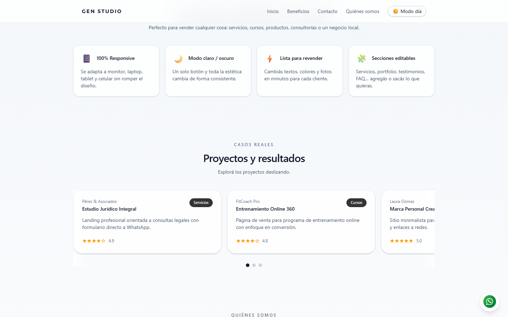

# GenStudio

Landing page profesional para presentar un negocio o servicio: diseño responsivo, modo oscuro, carrusel de portafolio y sistema de contacto integrado. La demo usa "GenStudio" como marca ficticia para mostrar la plantilla en acción — la idea es adaptarla rápido a cada cliente real.

### 🌐 [Ver demo en vivo →](https://landing-generic-ten.vercel.app/)

## 📸 Vista previa



<details>
<summary>Más capturas: modo oscuro, quiénes somos, portfolio</summary>





</details>

## 🎯 Stack

- **Next.js 16** - React framework
- **Tailwind CSS 4** - Utility-first CSS
- **TypeScript** - Type safety
- **Resend** - Email delivery
- **next-themes** - Dark mode

## 🚀 Setup Local

### 1. Instala dependencias
```bash
npm install
```

### 2. Configura variables de entorno
```bash
cp .env.example .env.local
```

Edita `.env.local` con:
```env
RESEND_API_KEY=re_xxxxxxxxxxxxx
CONTACT_TO_EMAIL=tu-email@example.com
CONTACT_FROM_EMAIL=onboarding@resend.dev
NEXT_PUBLIC_WHATSAPP_PHONE=+54XXXXXXXXXX  # optional
```

### 3. Corre servidor local
```bash
npm run dev
```
Abre [http://localhost:3000](http://localhost:3000)

## 🔨 Build & Deploy

```bash
# Build para producción
npm run build

# Start en producción
npm start
```

## 📋 Estructura

```
src/
├── app/
│   ├── page.tsx          # Home page principal
│   ├── layout.tsx        # Layout global
│   ├── globals.css       # Estilos globales
│   └── api/contact/      # API route para emails
├── components/           # Componentes reutilizables
│   ├── ContactForm.tsx
│   ├── PortfolioCarousel.tsx
│   ├── Navbar.tsx
│   └── ...
└── types/                # Type definitions
```

## 🎨 Features

✅ 100% Responsive (mobile-first)  
✅ Dark mode integrado  
✅ Animaciones subtle (Apple-style)  
✅ Carrusel infinito con scroll/click  
✅ Formulario con validación  
✅ Email delivery con Resend  
✅ Chat flotante WhatsApp (opcional)  
✅ Código limpio y escalable  

## 📌 Estado

**En desarrollo activo.** La landing está funcional y desplegada, con todo lo listado en Features.

- ✅ **Funciona:** diseño responsive, modo oscuro, animaciones, carrusel, formulario de contacto con Resend y chat de WhatsApp.
- 🔧 **En camino:** convertirla en una base reutilizable — variantes de secciones, contenido configurable y más plantillas para adaptarla rápido a cada cliente.

## 📞 Contacto

Sistema automático de emails con validación de spam (honeypot field).

## 👤 Autor

Desarrollado por [Marcos Martínez](https://github.com/MarcosJavMartinez).
